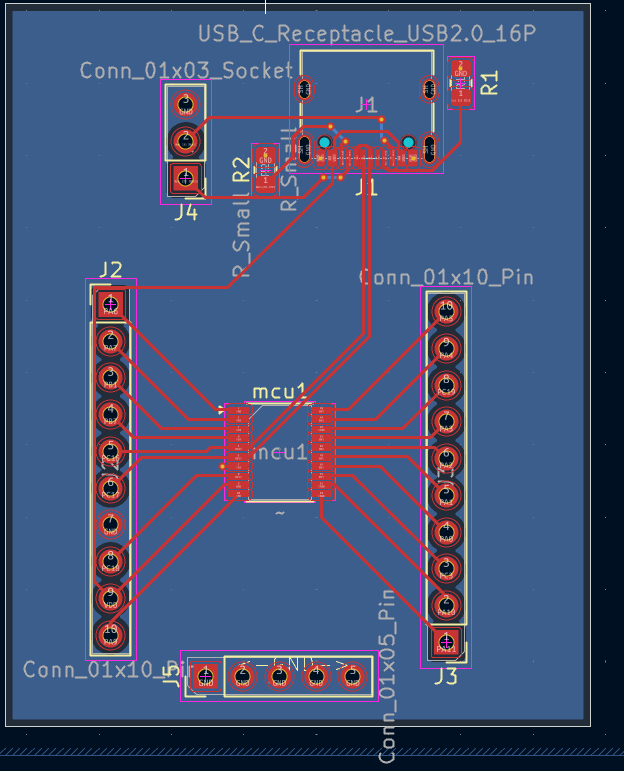
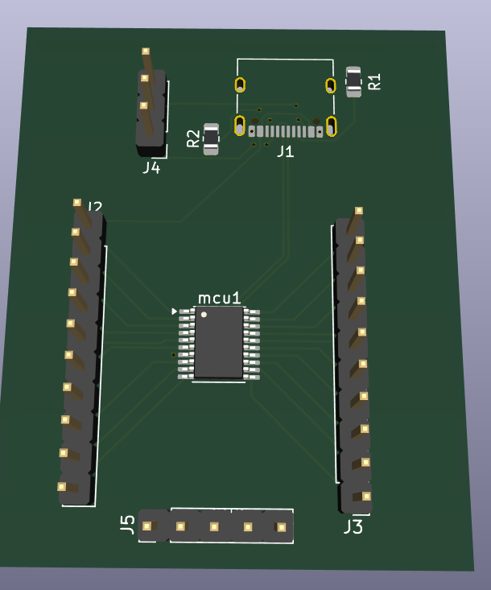
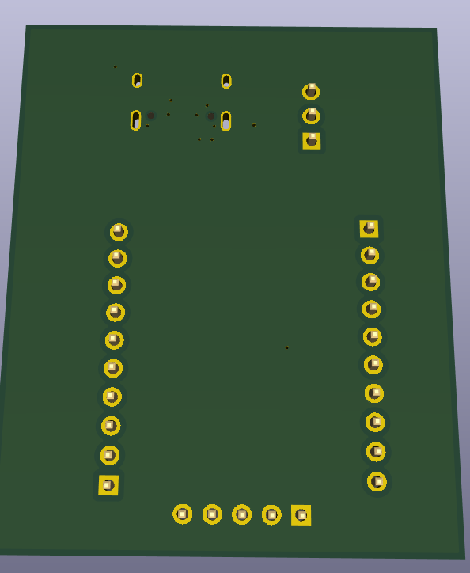

# CH32X033F8P6 Development Board

## Purpose

This project was developed by **Param Makers Adda** to provide an open hardware development board based on the **CH32X033F8P6** microcontroller. The design is intended to be studied, modified, manufactured, and improved by anyone under the terms of the CERN Open Hardware Licence Version 2 – Weakly Reciprocal (CERN-OHL-W v2).

Copyright © 2026 Param Makers Adda

This hardware is licensed under the CERN Open Hardware Licence Version 2 – Weakly Reciprocal (CERN-OHL-W v2).

See the `LICENSE` file for the full license text.

